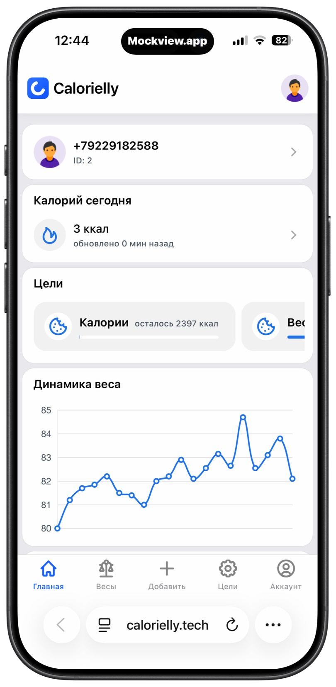
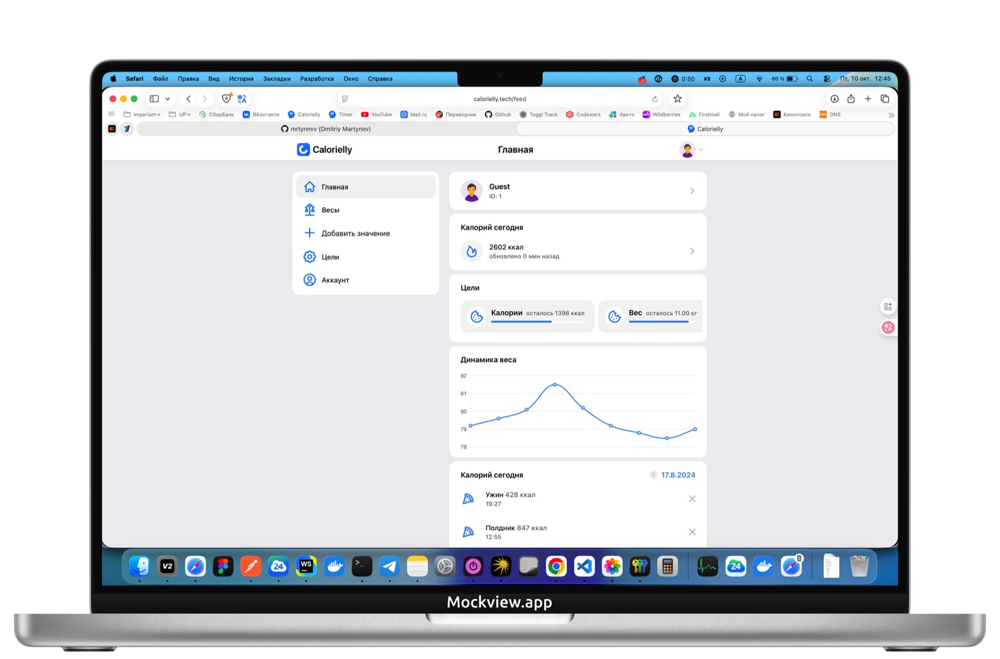

 <p align="center">

  

  

</p>

<p align="center">
  <i>Веб-приложение <a href="https://calorielly.tech">calorielly.tech</a> </i>
</p>
<h1 align="center">Calorielly</h1>
<p align="center">Счетчик калорий, дневник питания.</p>

<p align="center">
  <a href="https://github.com/Dexone/Calorielly/blob/main/LICENSE">
    
  </a>
</p>

## ✨ Особенности

- Calorielly — классный, удобный, отзывчивый и легко настраиваемый счетчик калорий
- Поддерживает авторизацию и создание аккаунта для новых пользователей
- Имеет гибкие настройки, планирование целей, калькулятор граммов
- Встроен график изменения веса и таймлайн дневника питания

## 🚀 Использование

Доступно по [этому адресу](https://calorielly.tech).

## ❓ Что это за штука?

Это приложение — рабочий pet-проект на Vue 3 + Vite с современным стеком:

- Vue 3 + TypeScript, Composition API и `script setup`.
- Vite + `@vitejs/plugin-vue` (без дополнительных авто-лоадеров страниц/лейаутов).
- Состояние: Pinia + `pinia-plugin-persistedstate` (localStorage для отдельных свойств).
- Графики: Chart.js через `vue-chart-3`.
- Стили: SCSS с автоподключением переменных/анимаций из `src/styles`.
- HTTP: Axios; базовый URL задается переменной окружения.

## 🧰 Локальная разработка

Требуется Node.js 20+ и npm.

1. Установка зависимостей:
   - `npm ci`
2. Запуск dev-сервера:
   - `npm run dev`
3. Сборка:
   - `npm run build`
4. Превью собранной версии:
   - `npm run preview`

Качество кода:

- ESLint: `npm run lint`
- Stylelint: `npm run stylelint`
- Prettier: `npm run format`
- Всё сразу: `npm run clean`

## 🧩 Backend (FastAPI)

Репозиторий: https://github.com/mrtynnvv/api-calorielly  
Public Swagger: https://dexone.pw/api/docs

- Префикс: все маршруты под `/api`
- Авторизация: OAuth2 Password (Bearer JWT)
- CORS: `http://localhost:5173`, `https://calorielly.tech`
- Хранилище: SQLModel + SQLite (dev); планируется миграция на PostgreSQL + Alembic

Эндпоинты (актуальные в репозитории):

- `POST /api/auth/register`
  - Вход: `{ phone: string, password: string }`
  - Ответ: `{ access_token: string, token_type: 'bearer' }`
- `POST /api/auth/login`
  - Вход: `{ phone: string, password: string }`
  - Ответ: `{ access_token: string, token_type: 'bearer' }`
- `GET /api/me`
  - Заголовок: `Authorization: Bearer <access_token>`
  - Ответ (пример): `{ id: number, phone: string, is_active: boolean }`

Примечание: схемы могут расширяться (например, лимиты калорий). Всегда сверяйте контракт по Swagger.

Локально:

- FastAPI: `http://localhost:8000` (итоговый базовый URL для фронта — `http://localhost:8000/api/`)
- Makefile/инструкции смотрите в репозитории backend

## 🔧 Переменные окружения

Создайте файл `.env` (или `.env.local`) и укажите базовый URL API:

```
VITE_API_BASE_URL=https://dexone.pw/api/
; локально: http://localhost:8000/api/
; при необходимости (легаси): https://dexone.pw/backend_new/
```

## 🧱 Структура

- `src/pages` — страницы (Feed, Auth, Profile, Settings, Scales, Other)
- `src/components` — UI/блоки/модалки
- `src/store` — Pinia-сторы
- `src/router` — маршрутизация
- `src/styles` — общие SCSS (`_variables.scss`, `_transitions.scss`, `main.scss`)
- `public` — статические ресурсы (favicon и т.п.)

Особенности:

- Guard’ы в роутере, meta `blank` для страниц без шапки/меню.
- Состояние пользователя частично сохраняется в localStorage.
- График динамики веса на Chart.js.

## ⚙️ CI/CD

- GitHub Actions: сборка на Node 20 и деплой на GitHub Pages
- SPA fallback: копирование `dist/index.html` в `dist/404.html` для корректной маршрутизации

## 💡 Инженерные акценты

- Строгая типизация: TypeScript строгий режим в `tsconfig.*` (noUnused, noFallthrough и др.)
- Единый стиль кода: ESLint flat config (с `@typescript-eslint` и `import`), Prettier, Stylelint для SCSS
- Архитектура фронтенда: Vue 3 Composition API + Pinia (персист через `pinia-plugin-persistedstate`), типизированные сторы
- Конфигурация Vite: алиас `@` в `/src`, глобальные SCSS-переменные и переходы, Vite 6
- Интеграция с Chart.js через `vue-chart-3`: типизированные `ChartOptions`/`ChartData`, реактивные источники
- Роутинг: четкое разделение layout’ов через `meta.blank`, навигационные гарды на уровне маршрутов
- Деплой: автоматизированная доставка на GitHub Pages, SPA fallback, кеширование зависимостей
- Безопасность (backend): OAuth2 Password Flow, JWT (JOSE), хеширование паролей (Passlib), CORS для prod/dev

## 🤝 Вклад

Любой вклад в проект приветствуется.
Возникла проблема? Откройте [issue](https://github.com/Dexone/Calorielly/issues/new/choose).  
Хотите добавить какую-то функцию? PR приветствуются!

## 👤 Об авторе

Не стесняйтесь обращаться ко мне:

<a href="https://t.me/mrtynnvv"></a>


## 📝 Licence

Copyright © 2025 [Dima Martynov](https://github.com/dexone).<br />
Этот проект находится под лицензией [MIT](https://github.com/Dexone/Calorielly/blob/main/LICENSE).<br />
_Использованные изображения принадлежат [icons8](https://icons8.ru/)._
